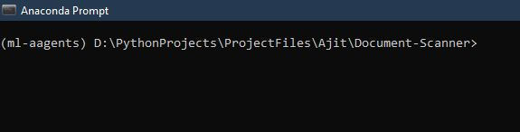
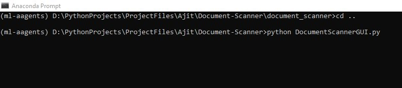
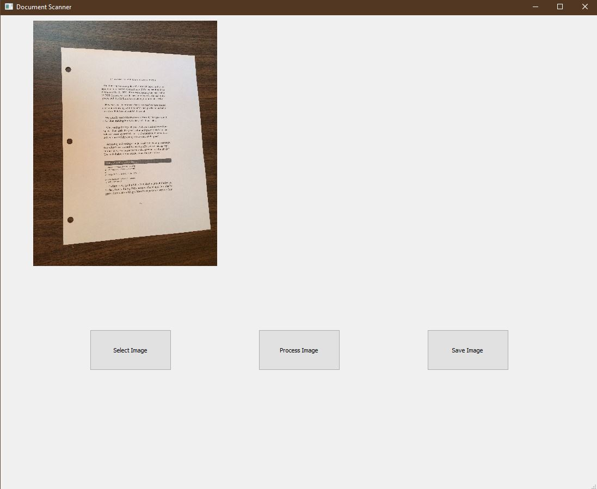

# Document-Scanner
This is for an image transformation framework which can be utilized for daily life needs and at the same time is easy to use.
<<<<<<< HEAD


### Prerequisites

imutils
numpy
cv2
PyQt5
skimage
auto-py-to-exe(For buildinng windows application)

```
You need to use python pip command to install these packages.
pip package_name
```
## Running the tests

To run the program, You need to run the DocumentScannerGUI.py

### Break down into end to end tests

Open Anaconda Prompt



Then browse and Run your program, Like DocumentScannerGUI.py



then It will Open a window like


Click on Select Image to Select the image


Click on process to Process the image.



This is the processed image.


Click on Save Image to save the image.


=======
>>>>>>> a84120dbd33c925a8c06245b28fac31a377dd141
